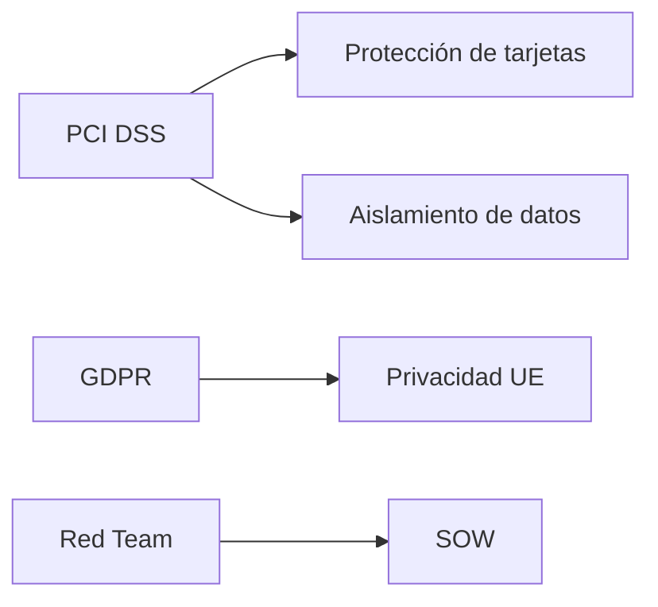

Aquí tienes una explicación estructurada y optimizada para integrar en **Obsidian**, con enfoque en conexiones entre conceptos (ideal para grafos de conocimiento):

---

### **2.1 Comparación y Contraste: Gestión, Riesgo y Cumplimiento (GRC)**
#### **Descripción General**
- **Contexto**: Evaluación de seguridad en *Pixel Paradise* para cumplir con marcos regulatorios (**GDPR** y **PCI DSS**).  
- **Riesgo**: Incumplimiento → Sanciones graves o prohibición de operar en ciertos países.  
- **Datos Sensibles**:  
  - Información de clientes (UE y EE.UU.).  
  - Transacciones con tarjetas de crédito (requiere **PCI DSS**).  

#### **2.1.1 Fase de Planificación** (Clave para evitar problemas legales)  
**Conceptos clave**:  
1. **Público objetivo**: ¿Quiénes son los stakeholders?  
2. **Reglas de compromiso**: Límites éticos y legales.  
3. **Comunicación**: Rutas de escalamiento y canales.  
4. **Recursos**: Presupuesto, herramientas, equipo.  
5. **Restricciones**: Técnicas (ej: no inyección SQL en BD productiva) o legales (ej: **GDPR**).  

**Equipos**:  
- **Red Team**: Simulan ataques reales.  
- **Blue Team**: Defienden la organización (SOC, CSIRT).  

---

### **2.1.2 Cumplimiento Normativo**  
#### **Regulaciones Clave**  
| Regulación  | Ámbito                             | Enlace Oficial                                                      |
| ----------- | ---------------------------------- | ------------------------------------------------------------------- |
| **PCI DSS** | Pagos con tarjeta                  | [PCI SSC](https://www.pcisecuritystandards.org)                     |
| **HIPAA**   | Datos de salud (EE.UU.)            | [CDC HIPAA](https://www.cdc.gov/phlp/publications/topic/hipaa.html) |
| **FedRAMP** | Servicios en la nube (gob. EE.UU.) | [FedRAMP](https://www.fedramp.gov)                                  |
| **GDPR**    | Privacidad (UE)                    | [GDPR Info](https://gdpr-info.eu)                                   |

#### **Sector Financiero**  
- **GLBA**: Obligatorio para todas las instituciones financieras (incluye tasadores, cobradores, etc.).  
  - Requiere pruebas de penetración periódicas.  
- **NY DFS 500.05**: Pruebas anuales de penetración y evaluaciones semestrales de vulnerabilidades.  

#### **Sector Salud**  
- **HIPAA**: Protege **ePHI** (información médica electrónica).  
  - Aplica a proveedores, planes de salud y socios comerciales.  

#### **Elementos Técnicos Críticos**  
1. **Aislamiento de datos**: Segmentación de red (ej: entornos PCI DSS).  
2. **Administración de contraseñas**: Complejidad, MFA, evitar defaults.  
3. **Gestión de claves**: Según **NIST SP 800-57** (criptografía).  

---

### **2.1.3 Restricciones Locales**  
- **Legalidad**: Leyes varían por país (ej: Sección 1030(a)(5)(B) de la Ley de Fraude Informático en EE.UU.).  
- **Documentación**: Autorización por escrito del cliente para pruebas.  
- **Ejemplos de limitaciones**:  
  - Herramientas prohibidas (ej: software criptográfico bajo **Acuerdo de Wassenaar**).  
  - Sistemas fuera de alcance (por criticidad).  

---

### **2.1.5 Conceptos Legales**  
| Término  | Definición                                               |
| -------- | -------------------------------------------------------- |
| **SOW**  | Alcance, timeline y requisitos técnicos de la prueba.    |
| **NDA**  | Confidencialidad de la información.                      |
| **MSA**  | Acuerdo marco para servicios recurrentes.                |
| **SLA**  | Niveles de servicio esperados (ej: tiempo de respuesta). |

#### **Contratos**  
- **Cláusulas clave**:  
  - Prohibición de exportar datos (ej: **GDPR**).  
  - Autorización explícita de proveedores externos (ej: cloud).  
- **Asesoría legal**: Imprescindible para evitar ambigüedades.  

#### **Descargos de Responsabilidad**  
- Ejemplo: *"El informe no garantiza inmunidad ante futuras vulnerabilidades"*.  
- Cubren:  
  - Limitaciones de las pruebas.  
  - No responsabilidad por pérdidas post-evaluación.  

---

--- 
