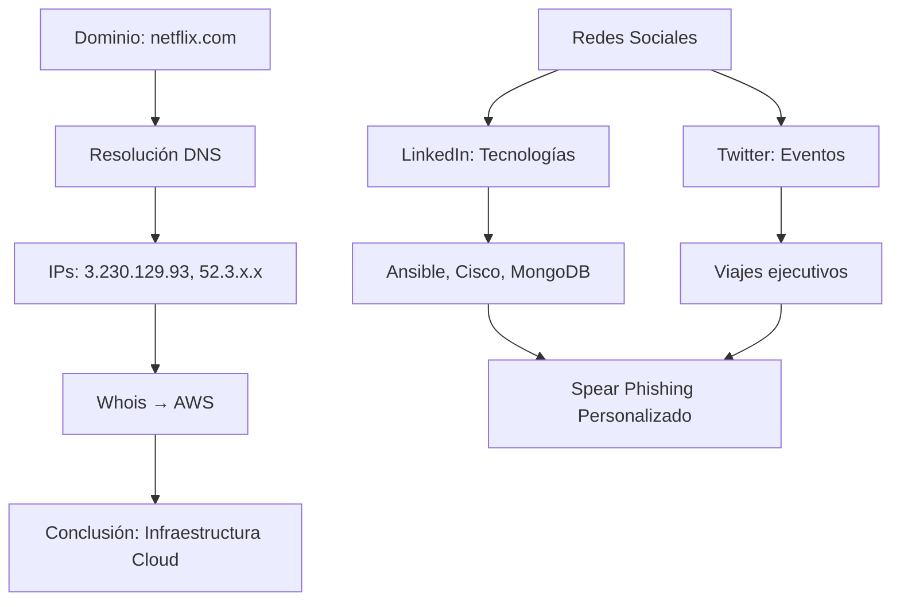

# 3.1 Realizar reconocimiento pasivo

## 3.1.1 Descripción General
- **Contexto**: Soluciones de seguridad Protego
- **Objetivo**: Mejorar habilidades de reconocimiento pasivo antes de investigar Pixel Paradise
- **Importancia**: El reconocimiento es el primer paso en un ataque cibernético o prueba de penetración
- **Componentes principales**:
  - Escaneo
  - Enumeración

> **Cita clave**:  
> *"Si conoces al enemigo y te conoces a ti mismo, no temas el resultado de cientos de batallas..."*  
> ― Sun Tzu, *El Arte de la Guerra*

## 3.1.2 Reconocimiento activo vs. pasivo

### Reconocimiento Activo
- **Definición**: Envío activo de sondeos a sistemas/redes objetivo
- **Características**:
  - Interacción directa con el objetivo
  - Puede usar múltiples protocolos
  - Niveles variables de agresividad
- **Riesgos**:
  - Posibilidad de bloquear dispositivos sensibles (ej. impresoras antiguas)
  - Mayor detección por sistemas de seguridad
- **Herramientas/Métodos comunes**:
  - Enumeración de hosts, redes, usuarios, grupos
  - Enumeración de recursos compartidos, páginas web, aplicaciones, servicios
  - Elaboración de paquetes

### Reconocimiento Pasivo
- **Definición**: Recopilación de información sin interacción directa
- **Ventajas**:
  - No genera tráfico detectable
  - Bajo riesgo de afectar sistemas
  - Ideal para redes productivas críticas
- **Métodos**:
  - Uso de bases de datos de terceros
  - Escucha pasiva de tráfico de red
  - Deducción inteligente de información
- **Herramientas/Métodos comunes**:
  - Enumeración de dominios
  - Inspección de paquetes
  - OSINT (Inteligencia de código abierto)
  - Recon-ng
  - Intercepción pasiva

### Comparación clave
| Característica          | Activo                        | Pasivo                     |
|-------------------------|-------------------------------|----------------------------|
| Interacción             | Directa                       | Indirecta                  |
| Detección               | Alta probabilidad             | Baja probabilidad          |
| Impacto en sistemas     | Potencialmente disruptivo     | Mínimo impacto             |
| Uso en redes críticas   | No recomendado                | Ideal                      |
| Profundidad de información | Mayor detalle              | Limitado por fuentes       |
## 3.1.5 Búsquedas de DNS
#### Concepto Básico
- Los atacantes realizan búsquedas DNS como primer paso en el reconocimiento de un objetivo (ej: h4cker.org)
- Analogía: Similar a un ladrón que inspecciona puntos de entrada/salida de una casa
#### Proceso de Enumeration DNS
1. **Búsqueda inicial**: Determinar direcciones IP y subdominios
   - Ejemplo para h4cker.org:
     - www.h4cker.org → 185.199.108.153
     - mail.h4cker.org → 185.199.110.153
     - portal.h4cker.org → 185.199.110.153

2. **Herramientas comunes**:
   - `DNSRecon`: Herramienta avanzada en Kali Linux
     ```bash
     dnsrecon -d h4cker.org
     ```
     - Muestra: SOA, NS, MX, A, SPF, TXT records
     - Detecta DNSSEC configurado

   - `Dig`: Herramienta básica pero poderosa
     ```bash
     dig h4cker.org
     dig h4cker.org mx  # Para registros MX
     ```
     - Muestra direcciones IP asociadas y servidores de correo

   - Otras herramientas:
     - `nslookup`
     - `host`

## Información Obtenible
- **Registros clave**:
  - `A`: Direcciones IPv4
  - `MX`: Servidores de correo
  - `NS`: Servidores DNS
  - `TXT`: Registros SPF y otra información
  - `SOA`: Información de autoridad del dominio

## 3.1.7 Identificación de Contactos Técnicos
- **Whois**: Herramienta para información de registro de dominio
  ```bash
  whois h4cker.org
  whois tesla.com
  whois cisco.com | grep '@cisco.com'
```

```markdown
# 3.1.10 Aplicaciones en Cloud vs. On-Premise y Subdominios

## Caso de Estudio: Netflix
- **Dominio**: netflix.com
- **Direcciones IP**:
  - IPv4: 3.230.129.93, 52.3.144.142, 54.237.226.164
  - IPv6: 2600:1f18:631e:2f80::/64 (múltiples)
- **Servicios**:
  ```bash
  host netflix.com
  # Output: MX records apuntan a Google (email gestionado por GSuite)
  ```

### Propiedad de Infraestructura
- **Evidencia de Cloud (AWS)**:
  ```bash
  whois 3.230.129.93 | grep OrgName
  # OrgName: Amazon Technologies Inc.
  ```
  - Todas las IPs resueltas pertenecen a AWS → Netflix usa infraestructura cloud

## Implicaciones de Seguridad
1. **Footprinting**:
   - Identificar IPs de servicios cloud revela proveedores usados (AWS, Azure, GCP)
2. **Attack Surface**:
   - Subdominios como `api.netflix.com` podrían estar en diferentes clouds/proveedores

---

## 3.1.11 OSINT en Redes Sociales

#### Tácticas de Atacantes
- **Fuentes clave**:
  - LinkedIn (estructura organizativa)
  - Twitter (eventos en tiempo real)
  - Indeed/Monster (tecnologías usadas)

#### Ejemplo de Recolección:
```python
# Ejemplo teórico de búsqueda en LinkedIn
"Administrador de firewall Cisco" + "Raleigh" → Empresa X usa:
- Cisco Firepower
- Ansible
- MongoDB
```

## Ingeniería Social Avanzada
- **Spear Phishing**:
  - Uso de datos de promociones/reorganizaciones para personalizar ataques
- **Caza de Ballenas**:
  - Target: Ejecutivos (info de viajes en Instagram/Facebook)

### Caso Real:
- **Ofertas de trabajo falsas**:
  - Entrevistas técnicas para extraer info de:
    - Arquitectura de red
    - Versiones de software
    - Protocolos internos
## Mitigaciones
| Táctica               | Contramedida                          |
|-----------------------|---------------------------------------|
| Cloud Footprinting    | Limitar metadatos WHOIS con privacidad|
| Social Engineering    | Políticas de concienciación           |
| Job Posting Leaks     | Revisión de RRHH para datos sensibles |



**Notas adicionales**:
- Para investigación de subdominios: Usar herramientas como `Sublist3r` o `Amass`
- Plantilla de informe de threat intelligence en Obsidian:

  ## Threat Model: Empresa X
  - **Cloud Providers**: AWS (usando IPs 3.230.129.0/24)
  - **Tech Stack**:
    - Firewall: Cisco FTD
    - Automation: Ansible
  - **Social Footprint**:
    - CTO activo en Twitter hablando de migración a Azure

Aquí tienes el resumen estructurado para Obsidian, con cada apartado numerado y en un formato claro para tomar notas:

---

### **📌 3.1.13 Fallas Criptográficas**  

#### **🔍 Certificados SSL/TLS**  
- **Contienen información crítica**:  
  - Número de serie, nombre común (CN), organización, URI del servidor, detalles de OCSP/CRL.  
  - Ejemplo: Certificado de `h4cker.org` muestra:  
    - Emisor: Let's Encrypt.  
    - Algoritmo criptográfico y tamaño de clave.  
    - Período de validez.  

#### **🔄 Revocación de Certificados**  
- **CRL (Lista de Revocación de Certificados)**:  
  - Lista pública de certificados invalidados.  
- **OCSP (Protocolo de Estado de Certificado en Línea)**:  
  - Verifica en tiempo real si un certificado es válido.  

#### **🌐 Transparencia de Certificados**  
- **Objetivo**:  
  - Auditoría pública de certificados emitidos (respuesta a ataques como DigiNotar).  
- **Herramientas**:  
  - `crt.sh`: Busca subdominios asociados a un dominio (ejemplo: `h4cker.org`).  

---

### **📌 3.1.14 Reputación y Postura de Seguridad**  

#### **🔓 Volcados de Contraseñas**  
- **Fuentes de datos comprometidos**:  
  - Pastebin, GitHub, dark web (ejemplo: WeLeakInfo antes de ser incautado).  
- **Herramientas**:  
  - `h8mail`: Busca correos/contraseñas en brechas (`pip3 install h8mail`).  
Las siguientes son herramientas adicionales que le permiten buscar volcados o descargas de datos vulnerados:
	- **WhatBreach:** _[https://github.com/Ekultek/WhatBreach](https://github.com/Ekultek/WhatBreach)_
	- **LeakLooker:** _[https://github.com/woj-ciech/LeakLooker](https://github.com/woj-ciech/LeakLooker)_
	- **Buster:** _[https://github.com/sham00n/buster](https://github.com/sham00n/buster)_
	- **Scavenger:** _[https://github.com/rndinfosecguy/Scavenger](https://github.com/rndinfosecguy/Scavenger)_
	- **PwnDB:** _[https://github.com/davidtavarez/pwndb](https://github.com/davidtavarez/pwndb)_  
#### **📂 Metadatos de Archivos**  
- **Ejemplo con imágenes (Exif)**:  
  - Datos expuestos: Ubicación GPS, modelo de dispositivo, fecha/hora.  
- **Herramienta clave**:  
  - `ExifTool`: Extrae metadatos de imágenes, PDFs, etc.  

#### **🔎 Google Hacking (Dorking)**  
- **Operadores avanzados**:  
  - `filetype:xls`, `inurl:admin`, `intitle:"Index of /etc"`.  
- **Casos de uso**:  
  - Encontrar credenciales (`"public $password ="`).  
  - IDs de sesión expuestos (`JSESSIONID` en logs).  
- **Google Hacking Database (GHDB)**:  
  - Repositorio de búsquedas útiles para pentesting (ejemplo: `site:exploit-db.com/google-hacking-database`).  

#### **🕰️ Archivado Web**  
- **Wayback Machine**:  
  - Permite ver versiones antiguas de sitios (ejemplo: `cisco.com` en 1999).  

#### **💻 Repositorios de Código**  
- **Riesgos**:  
  - Credenciales hardcodeadas en GitHub/GitLab.  
  - Exposición de arquitectura interna.  

---

### **🛠️ Herramientas Clave**  
| Categoría          | Herramientas                              |  
|---------------------|------------------------------------------|  
| SSL/TLS             | `crt.sh`                                 |  
| Brechas de datos    | `h8mail`, `WhatBreach`, `PwnDB`         |  
| Metadatos           | `ExifTool`                               |  
| Búsquedas           | Google Dorks, GHDB                       |  
| Archivado           | Wayback Machine (`archive.org/web`)      |  
### **📌 3.1.20 Recopilación de Inteligencia de Código Abierto (OSINT)**  
**Definición**:  
- Método para recolectar información públicamente disponible sobre un objetivo (dominios, redes, personas, etc.).  
- **Fuentes comunes**: Motores de búsqueda, redes sociales, certificados SSL, metadatos, APIs públicas.  

---

## **🛠️ Herramientas Clave**  
### **1. Recon-ng**  
**Descripción**: Marco modular en Python para OSINT, inspirado en Metasploit.  
**Funcionalidades**:  
- Enumeración de subdominios, correos, perfiles sociales.  
- Integración con APIs (Shodan, Censys, LinkedIn, etc.).  
- Generación de informes (CSV, HTML, JSON).  

#### **📌 Pasos Básicos**  
1. **Iniciar**:  
   ```bash
   recon-ng
   ```  
2. **Comandos útiles**:  
   - `marketplace search <keyword>`: Buscar módulos (ej: `bing`).  
   - `marketplace install <module>`: Instalar módulos.  
   - `modules load <module>`: Cargar un módulo (ej: `recon/domains-hosts/bing_domain_web`).  
   - `options set SOURCE <dominio>`: Definir objetivo (ej: `h4cker.org`).  
   - `run`: Ejecutar el módulo.  

**Ejemplo**:  
```bash
[recon-ng][default] > modules load recon/domains-hosts/bing_domain_web  
[recon-ng][default][bing_domain_web] > options set SOURCE ejemplo.com  
[recon-ng][default][bing_domain_web] > run  
```  
![[Pasted image 20250618115918.png]]

---

### **2. Shodan**  
**Descripción**: Motor de búsqueda de dispositivos conectados a Internet (servidores, cámaras IoT, routers, etc.).  
**Usos clave**:  
- Identificar sistemas vulnerables (ej: servicios con Heartbleed).  
- Encontrar dispositivos con configuraciones inseguras (ej: contraseñas por defecto).  

#### **📌 Consultas Típicas**  
- **Cisco Smart Install**:  
  ```text
  cisco-ios port:4786  
  ```  
- **Bases de datos expuestas**:  
  ```text
  "MongoDB" "unauthorized"  
  ```  
- **Cámaras IoT**:  
  ```text
  "webcam" "password"  
  ```  

**Ejemplo de Resultado**:  
  
*Dispositivos con protocolo Cisco Smart Install expuesto*.  

---

## **🔍 Técnicas Avanzadas**  
### **Google Dorking**  
- **Operadores útiles**:  
  - `site:ejemplo.com`: Busca solo en ese dominio.  
  - `filetype:pdf "confidencial"`: Encuentra PDFs con esa palabra.  
  - `intitle:"index of /backup"`: Directorios expuestos.  

### **Metadatos con ExifTool**  
```bash
exiftool imagen.jpg  # Extrae GPS, modelo de cámara, software usado.  
```  


---

### **📊 Resumen de Herramientas**  
| **Herramienta** | **Uso Principal**                     | **Ejemplo de Comando**                     |  
|-----------------|---------------------------------------|--------------------------------------------|  
| **Recon-ng**    | Enumeración de dominios y perfiles.   | `modules load recon/domains-hosts/bing_domain_web` |  
| **Shodan**      | Búsqueda de dispositivos expuestos.   | `cisco-ios port:4786`                     |  
| **ExifTool**    | Extracción de metadatos.              | `exiftool archivo.jpg`                    |  
