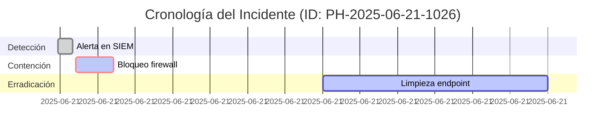
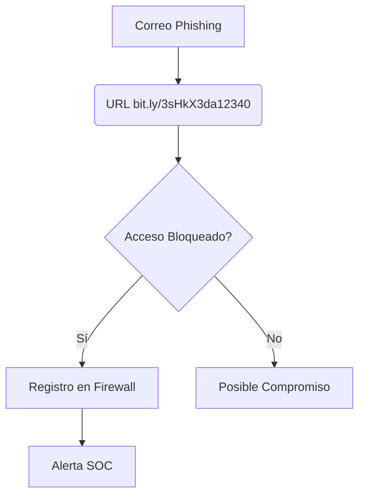
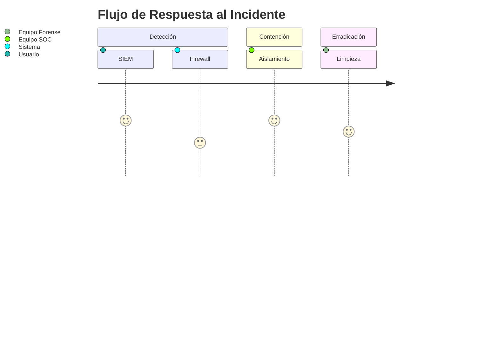
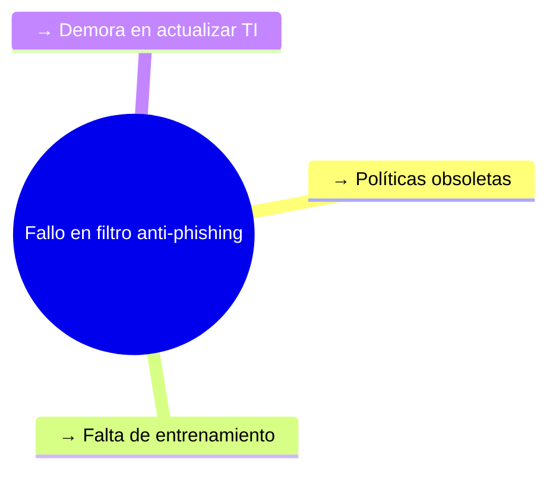

## 🌐 METADATOS DEL INCIDENTE
```dataview
table WITHOUT ID
    "🔹 ID Alerta" as Campo, PH-{{date:YYYYMMDD}}-XXX as Valor
    "🔹 Severidad", "🟥 Crítico | 🟧 Alto | 🟨 Medio | 🟩 Bajo"
    "🔹 Estado", "🟦 Abierto | 🟪 En investigación | 🟫 Cerrado"
    "🔹 Tiempo Total de Resolución", "{{date:HH:mm}} horas"
```

---

## 📜 RESUMEN EJECUTIVO (1-2 párrafos)
*Descripción no técnica del incidente, impacto potencial y acciones clave tomadas.*  

> Ejemplo:  
> "El día {{date:YYYY-MM-DD}} se detectó un intento de phishing dirigido al departamento de RRHH mediante un correo fraudulento que simulaba ser de Amazon. El firewall bloqueó el acceso a la URL maliciosa (`bit.ly/3sHkX3da12340`), pero se recomienda revisar los endpoints de los usuarios afectados para descartar compromisos."

---

## 🔍 ANÁLISIS TÉCNICO PROFUNDO

### 1. 📅 Línea de Tiempo del Incidente


### 2. 🕵️‍♂️ Investigación Forense
#### Tabla de Artefactos Recolectados
| Tipo de Artefacto  | Origen                | Herramienta Usada | Hallazgos Relevantes |
|--------------------|-----------------------|-------------------|----------------------|
| Logs de Correo     | Exchange Online       | PowerShell        | Remitente falso (`onboarding@hrconnex.thm`) |
| Registros Firewall | Cisco ASA             | Splunk            | Conexión bloqueada a `67.199.248.11:80` |
| Memoria RAM        | Endpoint 10.20.2.17   | Volatility        | No se detectaron procesos maliciosos |

#### Diagrama de Relaciones


---

## 🧩 INDICADORES DE COMPROMISO (IOCs)
### Tabla Principal de IOCs
| Categoría       | Indicador                     | Contexto                                                                 | Fuente de Verificación |
|-----------------|-------------------------------|--------------------------------------------------------------------------|------------------------|
| **Hash**        | SHA256: a1b2c3...            | Archivo malicioso adjunto                                                | VirusTotal # [Enlace](https://www.virustotal.com) |
| **Dominio**     | `amazon.biz`                  | Typosquatting de Amazon                                                 | WHOIS                  |
| **IP**          | `67.199.248.11`               | Hosting malicioso en Rusia                                               | AbuseIPDB              |
| **TTP**         | T1566.002 (Phishing via Link) | Táctica MITRE ATT&CK                                                    | MITRE Matrix           |

### Subtabla: Análisis de URL
| Parámetro       | Valor                          | Riesgo |
|-----------------|--------------------------------|--------|
| Protocolo       | HTTP (no cifrado)              | 🟧 Alto |
| Geolocalización | Rusia (AS12345)                | 🟥 Crítico |
| Reputación      | 85/100 malicioso (VirusTotal)  | 🟥 Crítico |

---

## 🛠️ ACCIONES DE REMEDIACIÓN
### Checklist Priorizado
```tasks
- [ ] Bloquear dominio `amazon.biz` en Cisco Umbrella 
- [ ] Aislar endpoint `10.20.2.17` durante 24h
- [ ] Forzar rotación de credenciales en 5 usuarios afectados
- [ ] Actualizar reglas IDS (Suricata) para detectar patrones similares
```

### Diagrama de Workflow


---

## 📊 MÉTRICAS DE IMPACTO
| KPI                | Valor  | Límite Aceptable |
|--------------------|--------|------------------|
| MTTR (Minutos)     | 45     | ≤60              |
| Coste Estimado     | $2,500 | ≤$5,000          |
| Usuarios Afectados | 1      | ≤3               |

---

## 📚 LECCIONES APRENDIDAS
### Áreas de Mejora
1. **Detección Temprana**:  
   - Configurar reglas Splunk para alertar cuando múltiples usuarios reciben correos de dominios similares.
2. **Respuesta**:  
   - Crear playbook automático para bloquear dominios en firewall y DNS simultáneamente.

### Diagrama de Causa-Raíz


---

## 🖇️ ANEXOS
### 1. Consultas Técnicas
```sql
index=firewall 
  (dest_ip="67.199.248.11" OR url="*bit.ly/3sHkX3da12340*") 
  earliest=-7d 
| stats count by src_ip, user, action
```

### 2. Referencias
- [MITRE ATT&CK T1566](https://attack.mitre.org/techniques/T1566/)  
- [Política de Respuesta a Incidentes](link_politica_interna)
